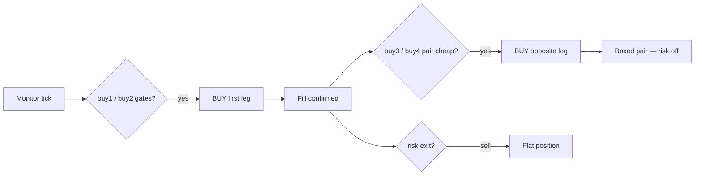

# Polymarket Arbitrage Trading Bot (BTC, ETH Momentum Arbitrage trading bot)

TypeScript bot for Polymarket **CLOB V2** **5-minute** BTC and ETH Up/Down markets. It monitors Chainlink strike/spot vs order books, enters momentum-aligned positions late in each epoch, optionally completes the opposite leg for a boxed pair, and manages exits with configurable risk rules.


You can check this bot pnl with this account.

https://polymarket.com/@9g9g99


https://github.com/user-attachments/assets/4b69f7a8-5ae0-4465-b2c2-03d38c1886f4


Built with [`@polymarket/clob-client-v2`](https://docs.polymarket.com/) and **Node.js 20+**. See [V2_MIGRATION.md](V2_MIGRATION.md) for Polymarket exchange upgrade notes.


## Features

- **Dual-market confirmation** — BTC and ETH must align before entries (reduces false signals)
- **Chainlink Data Streams** — strike at epoch open + live spot for `spot_minus_strike`
- **High-frequency monitor** — REST CLOB `/book` polling (~150ms), merged btc/eth wave logs
- **Six strategy phases** — buy1, buy2, buy3, buy4, risk1, risk2, risk3
- **Paper trading** — simulated fills without live CLOB orders
- **Optional redeem** — gasless redeem via Polymarket builder relayer after epoch end
- **Deposit wallet (POLY_1271)** — V2 signing with `viem` + official TypeScript SDK

## How it works

Each **5-minute epoch** the bot runs:

```
MONITOR (order books + strike/spot + strategies)
    → [optional] REDEEM winning tokens
    → next epoch
```

**Core signal:** `spot_minus_strike = chainlink_spot − epoch_strike`

- Positive → price above strike → favors **YES** (Up)
- Negative → price below strike → favors **NO** (Down)

The bot does **not** split/merge tokens. It buys outcome shares on the CLOB and optionally redeems after resolution.


### Strategy flow



| Phase | Market | When | Action |
|-------|--------|------|--------|
| **buy1** | BTC | `t_minus` in window | GTC BUY YES or NO (momentum entry) |
| **buy2** | ETH | `t_minus` in window | GTC BUY YES or NO (momentum entry) |
| **buy3** | BTC | After buy1 fill | GTC BUY opposite if `fill_px + opp_ask < 0.95` |
| **buy4** | ETH | After buy2 fill | GTC BUY opposite if `fill_px + opp_ask < 0.95` |
| **risk1** | BTC or ETH | After fill | Stop loss vs entry price |
| **risk2** | BTC or ETH | After fill | Time stop |
| **risk3** | BTC or ETH | After fill | Dead-market / low-bid exit |

**buy1** and **buy2** are independent (both can fire in one epoch). **buy3**/**buy4** complete the pair when the combined cost is below `pair_sum_max`. Risk exits are skipped once the pair is fully boxed.

### buy1 / buy2 entry gates

All must pass on consecutive monitor ticks (`monitoring_cycles`, default 2):

1. **Time** — `trigger_time_end_sec ≤ t_minus ≤ trigger_time_start_sec`
2. **Momentum size** — `|spot_minus_strike_btc|`, `|averge_spot_minus_btc|`, `|spot_minus_strike_eth|` above configured minimums
3. **Sign alignment** — BTC spot, BTC epoch average, and ETH spot all same sign
4. **Target book** — spread `< max_spread`, `best_ask > min_best_ask`
5. **Cross confirmation** — paired symbol same outcome: `best_bid > other_symbol_min_best_bid`

### buy3 / buy4 pair completion

After a confirmed **buy1** (BTC) or **buy2** (ETH) fill:

1. `first_leg_fill_price + opposite_best_ask < pair_sum_max` (default `0.95`)
2. GTC limit **BUY** opposite outcome at `opposite_best_ask + opposite_buy_offset` (default `+0.03`)
3. Same share count as the first leg · one attempt per epoch per symbol

### Risk exits

Priority each tick: **risk1 → risk2 → risk3**. Disabled after buy3/buy4 fully boxes the position.

In `config/default.yaml`, risk is nested under `risk.stop_loss`, `risk.time_stop`, and `risk.dead_market` (mapped internally to `risk1`, `risk2`, `risk3`).

## Project structure

```
src/
  cli.ts                 # CLI entry (commander)
  engine.ts              # Epoch cycles, market orchestration
  config.ts              # YAML + .env loading
  schedule.ts            # UTC trading windows
  constants.ts           # V2 contract addresses, API URLs
  execution/
    executor.ts          # Monitor loop, merged wave logs
    exitStrategy.ts      # buy1–buy4 + risk1–risk3 coordinator
    clobClient.ts        # @polymarket/clob-client-v2 wrapper
    paperExchange.ts     # Paper trading simulation
    redeem.ts            # Relayer redeem
    redeemScheduler.ts
  data/
    gamma.ts             # Market discovery by slug
    clobRest.ts          # Public order book REST
    clobUserWs.ts        # Authenticated fill WebSocket
    chainlinkFeed.ts     # Spot price polling
    strikePrice.ts       # Epoch strike resolution
config/
  default.yaml           # Strategy + monitor settings
.env.example             # Secrets template (copy to .env)
```

Legacy Python sources remain in `src/polybot5m/` for reference only.

## Requirements

- **Node.js 20+**
- **npm**
- Polymarket account with **pUSD** (live mode)
- **Chainlink Data Streams** credentials (strike/spot)
- **CLOB API keys** + **private key** (live mode)
- **Builder relayer keys** (only if `redeem_enabled: true`)

## Quick start

```bash
git clone https://github.com/DextersSlab/Polymarket-Arbitrage-Trading-Bot.git
cd Polymarket-Arbitrage-Trading-Bot
npm install
cp .env.example .env    # Windows: Copy-Item .env.example .env
```

Edit `config/default.yaml`:

```yaml
bot:
  paper_trading: true   # false for live trading
```

Add secrets to `.env` (see [Configuration](#configuration)). For paper mode you can run immediately; live entries need Chainlink + wallet keys.

**Paper mode (recommended first):**

```bash
npm run dev
```

**Production build:**

```bash
npm run build
npm start -- --paper          # respects YAML paper_trading
node dist/cli.js run --paper  # explicit paper
```

**One epoch test:**

```bash
npx tsx src/cli.ts run --paper --cycles 1
```

## Usage

```bash
# Default config (config/default.yaml)
npx tsx src/cli.ts run

# Flags
npx tsx src/cli.ts run --paper              # force paper mode
npx tsx src/cli.ts run --dry-run            # no on-chain redeem
npx tsx src/cli.ts run --cycles 5           # stop after 5 epochs
npx tsx src/cli.ts run -c config/default.yaml
npx tsx src/cli.ts run --log-file logs/run.log --log-timestamp-name
```

| npm script | Command |
|------------|---------|
| `npm run dev` | `tsx src/cli.ts run --paper` |
| `npm run build` | Compile to `dist/` |
| `npm start` | `node dist/cli.js run` |

### Paper vs live

| Mode | Config | Behavior |
|------|--------|----------|
| **Paper** | `bot.paper_trading: true` or `--paper` | Simulated fills, no CLOB user WS, no redeem |
| **Live** | `bot.paper_trading: false` | Real orders via CLOB V2, user WS for fills |
| **Dry run** | `--dry-run` | Live monitor/orders but skips on-chain redeem tx |

CLI `--paper` overrides YAML. Env override: `POLYBOT5MBES_BOT__PAPER_TRADING=true`.

## Configuration

Settings load from **`config/default.yaml`**, then **`.env`** (env wins). Prefix: `POLYBOT5MBES_` with `__` nesting.

```bash
POLYBOT5MBES_EXECUTION__PRIVATE_KEY=0x...
POLYBOT5MBES_EXECUTION__API_KEY=...
POLYBOT5MBES_EXECUTION__API_SECRET=...
POLYBOT5MBES_EXECUTION__API_PASSPHRASE=...
POLYBOT5MBES_EXECUTION__RPC_URL=https://...
POLYBOT5MBES_PRICE_FEED__CHAINLINK__STREAMS_USER_ID=...
POLYBOT5MBES_PRICE_FEED__CHAINLINK__STREAMS_SECRET=...
POLYBOT5MBES_EXECUTION__BUILDER_CODE=0x...        # optional CLOB attribution
POLYBOT5MBES_EXECUTION__BUILDER_API_KEY=...     # redeem relayer
POLYBOT5MBES_BUY3__PAIR_SUM_MAX=0.95
POLYBOT5MBES_RISK__STOP_LOSS__ENABLED=false
```

### YAML layout

`default.yaml` uses a compact layout. The loader normalizes:

| YAML key | Internal key |
|----------|--------------|
| `monitor.*` | `liquidity_maker.*` |
| `epoch`, `symbols` | `liquidity_maker.markets` |
| `risk.stop_loss` | `risk1` |
| `risk.time_stop` | `risk2` |
| `risk.dead_market` | `risk3` |

### Key settings (current defaults)

**Markets:** `btc`, `eth` · **epoch:** `5m` · **poll:** `0.15s`

**buy1 (BTC):** window 100s→8s · 50 shares · GTC @ 0.99 · min ask 0.90

**buy2 (ETH):** window 60s→3s · 5 shares · stricter BTC/ETH momentum filters

**buy3 / buy4:** `pair_sum_max: 0.95` · `opposite_buy_offset: 0.03` · GTC

**risk:** stop_loss on (0.40 offset) · time_stop off · dead_market on (bid &lt; 0.42)

**redeem:** disabled by default · set `monitor.redeem_enabled: true` to enable

Verify config loads:

```bash
npx tsx -e "import { loadConfig } from './src/config.ts'; const c = loadConfig('config/default.yaml'); console.log(c.liquidity_maker.markets, c.bot.paper_trading, c.buy3);"
```

## Polymarket V2 integration

Live trading uses the [Polymarket Trading Quickstart](https://docs.polymarket.com/trading/quickstart):

- SDK: `@polymarket/clob-client-v2`
- Wallet: deposit wallet · `SignatureTypeV2.POLY_1271` (type `3`)
- Collateral: **pUSD** (not legacy USDC.e)
- API creds: `createOrDeriveApiKey()` from your private key

Full checklist: [V2_MIGRATION.md](V2_MIGRATION.md).

## Console output

Merged monitor wave (every poll):

```
⏰t_minus=12.345s
  [btc/5m] [STRIKE_SPOT] target=… chainlink_spot=… spot_minus_strike_btc=…
  [eth/5m] [STRIKE_SPOT] …
  [btc/5m] [MARKET_TICK] 🟢YES best_ask=… best_bid=… 🔴NO …
  [eth/5m] [MARKET_TICK] …
```

### Strategy JSONL events

Written to `exports/trading_process.jsonl` when configured (`monitor.trading_process_jsonl`).

| Event | Meaning |
|-------|---------|
| `BUY1_TRIGGER` / `BUY2_TRIGGER` | Entry conditions met |
| `BUY1_ORDER` / `BUY2_ORDER` | Order sent, awaiting fill |
| `BUY1_FILL` / `BUY2_FILL` | First leg filled |
| `BUY3_TRIGGER` / `BUY4_TRIGGER` | Pair completion conditions met |
| `BUY3_ORDER` / `BUY4_ORDER` | Opposite leg order sent |
| `BUY3_FILL` / `BUY4_FILL` | Pair boxed |
| `RISK1_TRIGGER` … `RISK3_DONE` | Protective exit lifecycle |
| `BUY*_ABORT` | Order rejected |

## Notes

- Strike/spot values in logs are **signals**, not guaranteed settlement prices.
- Never commit `.env` or real API keys.
- `averge_spot_minus_btc` spelling is intentional (matches config/code).
- Test thoroughly in **paper mode** before live trading.


## Keywords
polymarket arbitrage bot, polymarket trading bot, polymarket bot github, prediction market arbitrage, arbitrage, trading, arbitrage bot, opensource, python, arbitrage bot, prediction market

## 👤 Operator / Contact
If you encounter any issues or are interested in other profitable Polymarket trading bots, feel free to reach out to me.

- Telegram: [@DextersSlab](https://telegram.me/DextersSlab)

This publicly available codebase reveals only half of the core strategy. Therefore, the bot buys in only one short time zone. However, this bot detects strong momentum and leverages it to generate profits. This is another appeal of this bot..

---

[](https://github.com/nahuelvivas/Polymarket-Arbitrage-Trading-Bot/stargazers)
[](https://github.com/nahuelvivas/Polymarket-Arbitrage-Trading-Bot/network/members)
[](https://github.com/nahuelvivas/Polymarket-Arbitrage-Trading-Bot/blob/main/LICENSE)
[](https://github.com/nahuelvivas/Polymarket-Arbitrage-Trading-Bot/commits/main)
[](https://github.com/nahuelvivas/Polymarket-Arbitrage-Trading-Bot/issues)
